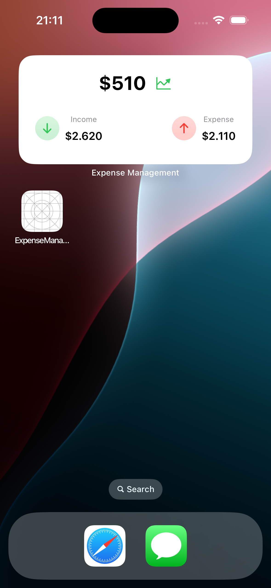
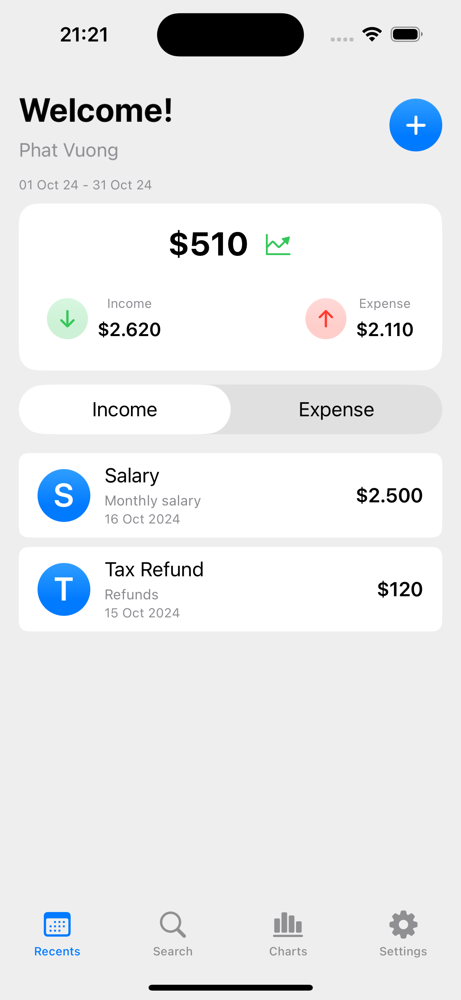
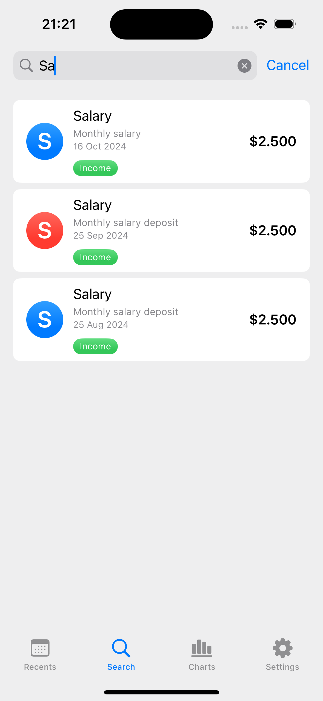
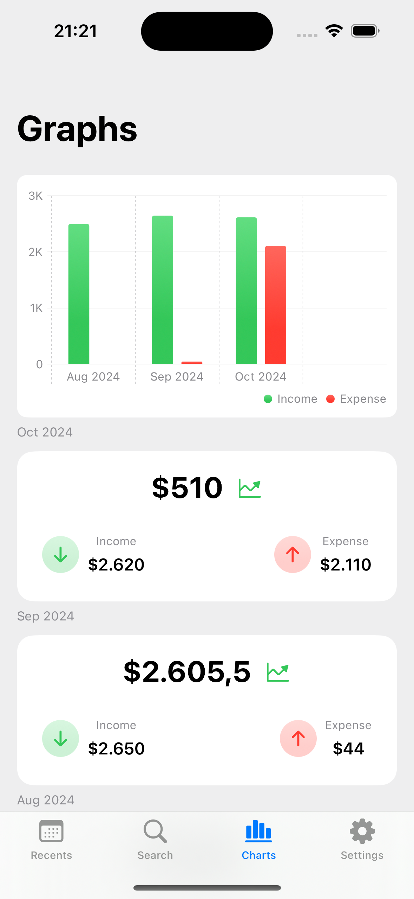
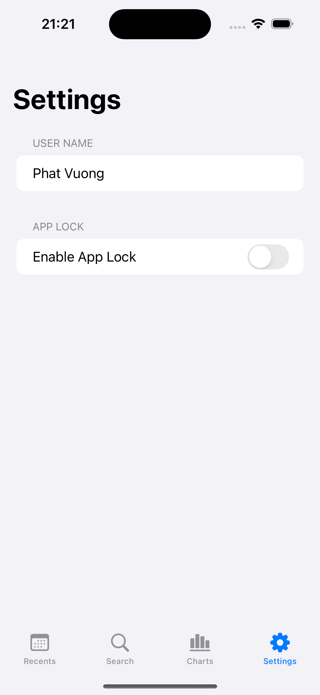
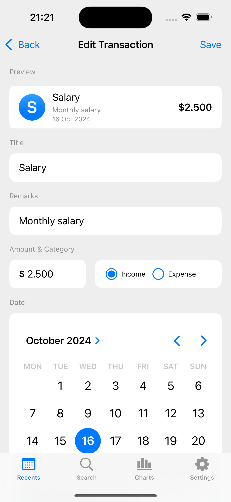
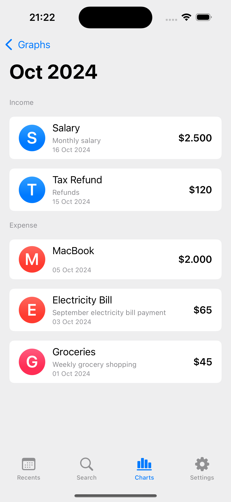

# Expense Management App

## Overview
The Expense Management App is a comprehensive tool for tracking expenses, providing insightful charts, and ensuring data security with app locking features. Built with **SwiftUI**, it leverages **SwiftData** for managing transactions, integrates with widgets for a seamless user experience, and includes app lock functionality for added security.

## Screenshots
<!-- Optionally, add screenshots here -->

### Key Features
- **Track Expenses:** Easily add, edit, and delete expense records.
- **Visualize Data with Charts:** Get insights into your spending with interactive charts.
- **SwiftData Integration:** Efficiently manage and store transactions.
- **Widgets:** Quickly view recent expenses or insights directly from your home screen.
- **App Lock:** Secure your data with biometric authentication (Face ID/Touch ID).
- **SwiftUI Interface:** A modern, intuitive interface designed for iOS.

## Demo Video

Click the image above to watch the demo video.

## How it Works
The app utilizes SwiftData for managing data persistence, ensuring that all transactions are efficiently stored and retrieved. SwiftUI provides a seamless, modern interface, while Charts offer clear visualizations of spending trends. Biometric authentication adds a layer of security, protecting sensitive financial data.

## SwiftUI Widgets
The app comes with customizable widgets that allow you to view recent expenses or spending trends without opening the app.

## Requirements
- iOS 17.0+
- Xcode 15.0+

